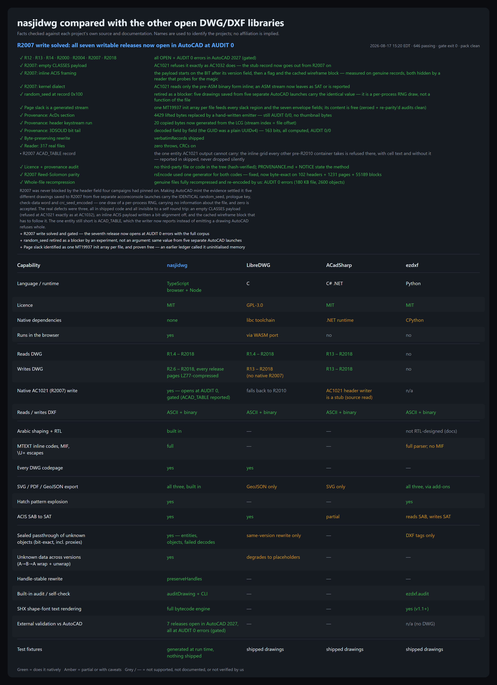

# nasjidwg

A DWG and DXF library written entirely in TypeScript, with Arabic and RTL
text handled properly rather than as an afterthought. No native modules,
no WASM, no filesystem assumptions: the same build runs in a browser, in
Node, in Electron and inside a web worker.

```ts
import { readDwg, writeDxf, writeSvg } from 'nasjidwg';
import { readFileSync, writeFileSync } from 'node:fs';

const drawing = readDwg(new Uint8Array(readFileSync('plan.dwg')));

console.log(drawing.header.version);            // 'R2018'
console.log(drawing.layers.map(l => l.name));   // ['0', 'walls', 'doors', …]
console.log(drawing.entities.length);           // model-space entity count

writeFileSync('plan.dxf', writeDxf(drawing));   // out as DXF
writeFileSync('plan.svg', writeSvg(drawing));   // or as a picture
```


---

## How it compares



(The table is generated from data — `node tools/gen-comparison.mjs` — so it
cannot drift from what the repository actually does. The PNG above is the
render GitHub will show; [docs/comparison.svg](docs/comparison.svg) is the
vector original beside it.)

Three things worth pulling out of it:

**Nothing it doesn't understand is ever lost.** Every record the
semantic layer cannot model — an unknown application class, a proxy, a
record whose decode fails — is retained *sealed*: payload bit-exact,
string stream verbatim, handle references code-for-code, cached display
list byte-for-byte. It is re-emitted natively in its own encoding
generation, travels **wrapped in a proxy record across generations and
unwraps back to native on return** (verified through a
2018 → R13 → 2004 → 2018 odyssey), and survives the DXF path too — a
record that arrived through DXF leaves as its verbatim tags, under the
owner it had. That is the same preservation contract AutoCAD itself
offers for objects it has no enabler for.

**AutoCAD itself signs off on the output.** All seven writable release
families — R12, R13, R14, R2000, R2004, R2007 and R2018 — open in
AutoCAD 2027 with **zero AUDIT errors**, and a harness in the repository
re-checks every one so a regression fails loudly. Getting there took nine
campaigns against AutoCAD as the oracle and turned up defects no
self-consistent test could ever have found, because a reader and a writer
can share the same wrong belief and still round-trip perfectly. The
tenth campaign put a real drawing through: 72 MB, 246k entities, 9,522
fit splines, 68 ACIS solids — read, rewritten in both handle modes and
once more through a full DXF round trip, then opened in AutoCAD 2027 at
**RECOVER and AUDIT 0 errors, 0 erased** (the untouched source itself
audits 18), its plot matching AutoCAD's plot of the original section for
section. Eleven writer spellings this library's own reader had always
tolerated died there — the R2013+ SPLINE scenario form, multi-solid AcDs
payloads, forged ellipse normals, true colours collapsed to an index
among them — each one read off AutoCAD's own bytes and pinned by a test.
R2007 carries one documented limit, and it is the format's own rather than
ours: an ASM-dialect ACIS payload cannot travel inline in an AC1021 file,
because that container's kernel reads only the pre-ASM form — so it
leaves as SAT text, or is reported to the caller. See
[PARITY.md](PARITY.md).

**A drawing comes back the way it was drawn.** Entities arrive in the
order they paint, not the order they were stored: the SORTENTSTABLE that
a modern file uses to put a mask over the wall it hides is decoded and
applied, so `drawing.entities` *is* the draw order, and a rewrite that
keeps its handles writes the table back out. Attributes keep their
invisible and constant flags, so a title block's hidden ATTDEFs stay
hidden instead of surfacing as giant text. Text keeps the STYLE it was
written with — font file, typeface, width factor, oblique — including
the TrueType families a file names only in the style record's extended
data. And curvature that is degenerate stays degenerate: a bulge whose
sagitta is a billionth of its chord, or an arc stored with a zero sweep,
draws as the hairline AutoCAD draws rather than as the enormous circle
it was cut from.

**A drawing that is laid out at an angle stays that way.** Site plans are
routinely drawn turned — the model sits at 45°, and it reads square only
because the file carries VIEWTWIST in its saved view and a rotated UCS in
its header. Both survive read, write and the DXF trip in every release,
and `viewTwistTransform` / `ucsTransform` hand a renderer the transform
that squares the model. The VPORT record is graded field for field
against AutoCAD's own DXFOUT: 36 of 36, on nine drawings.

**Arabic is not an add-on.** Shaping into presentation forms, bidi
resolution, MTEXT inline codes, MIF and \\U+ escapes, and every codepage
the format can name — all of it is in the read and write paths, in every
release from R1.4 to R2018. No other DWG library does this at all.

---

## How it was built — and why that means bugs get fixed fast

nasjidwg was built by an agentic workflow driven by Claude Fable 5, over
**three days**. Not typed by hand, and not a demo: the format work in it
is real reverse engineering, and it was held to an external standard the
whole way — AutoCAD 2027 itself opens and AUDITs the output, and six
releases are gated on it in this repository.

That is worth stating plainly for one practical reason. **If you hit a
bug, please report it — it will very likely be fixed the same day.** The
same workflow that wrote the library can be pointed at a failing drawing,
and the machinery it left behind is built for exactly that: a validation
harness that grades output against AutoCAD, a reader certified on 317
real drawings, 639 tests that regenerate every fixture from scratch, and
a written ledger of what is known about the format, including what is
still unknown.

**[Open an issue](https://github.com/NASJI-Packages/nasjidwg/issues)**
with the smallest drawing that reproduces it, if you can share one — a
version, an entity type and what went wrong is already enough to start.
Reports about files this library reads *wrongly* are the most valuable
kind: three of the worst defects found so far were cases where the reader
and the writer shared the same wrong belief and agreed with each other
perfectly, which no self-consistent test can ever catch.

What the workflow does not give you for free is correctness, so nothing
here rests on it. Every claim in this README is backed by something that
runs: `npm test` regenerates the whole corpus with the library's own
writers, the DWG and DXF codecs cross-check each other, and
`node tools/validate-external.mjs` re-opens all seven writable releases —
and the ASCII DXF — in AutoCAD and fails if any of them regresses.
Defects found by those mechanisms — a Reed-Solomon parity bug that made
every R2007 data page invalid, an inline ACIS payload written one
bit-alignment off, a CLASSES section AutoCAD refuses when empty, an AC1021
table cell written as a bare string where the format keeps a whole typed
value, a view twist that was never decoded and drifted every field behind
it, a one-byte dictionary shift that had blocked R13 for four campaigns, a
VPORT aspect field that left as the raw view width when DXF group 41
means width ÷ height, and DXF header extents re-derived from entities so
that two invisible strays framed 99.96% blank paper — were found because
the mechanisms exist, not because the model was careful. The last two
came in as [a field report](https://github.com/NASJI-Packages/nasjidwg/issues/1),
the most valuable kind of issue this project receives. The next one,
[issue #2](https://github.com/NASJI-Packages/nasjidwg/issues/2), was the
same 72 MB drawing's write-side losses: a forged +Z extrusion on every
OCS entity but ELLIPSE, XDATA dropped with no warning, ATTRIB alignment
and handles discarded, and HATCH associativity arriving undefined.

---

## What this is for

DWG is AutoCAD's native format. It is binary, undocumented by its vendor,
and has changed shape roughly every three years since 1982 — the bytes in
a file from 1985 have nothing in common with one saved yesterday. DXF is
its text sibling: readable, far more widely supported, and lossy in
places.

If you need to open either from JavaScript, your options have been a C
library compiled to WASM (large, read-only, awkward to ship) or moving
the work off the browser entirely. This library removes that choice: it
decodes and encodes both formats in plain TypeScript.

It also fixes something CAD tooling reliably gets wrong. Arabic in a CAD
file is stored in logical order, but must be drawn in shaped presentation
forms, with brackets mirrored and joining preserved. Most pipelines break
one of those three. This one carries the whole chain, and the document
model always holds logical Arabic so your own code never has to think
about it.

## The document model

Everything centres on one plain-JSON structure, `Drawing`, defined in
[src/core/model.ts](src/core/model.ts). Read a DWG, read a DXF, or build
one by hand — you get the same shape, and every writer takes it:

```ts
interface Drawing {
  header: Header;                     // version, extents, units, summary, thumbnail
  layers: Layer[];
  linetypes: Linetype[];
  textStyles: TextStyle[];
  blocks: Record<string, BlockDefinition>;
  entities: Entity[];                 // model space
  paperSpace?: Entity[];
  layouts?, groups?, mlineStyles?, ucs?, views?, vports?, dimStyles?,
  appIds?, xrecords?, geoData?,
  proxyObjects?, unknownObjects?;     // everything else the file carried,
                                      // sealed records included
  warnings: string[];                 // what could not be read, never silent
}
```

`Entity` is a discriminated union — `e.type === 'circle'` narrows to the
circle fields, so TypeScript guides you through it. There are no classes,
no getters, no hidden state: a `Drawing` survives `JSON.stringify` and
comes back identical, which makes it trivial to cache, diff, post to a
worker or store.

## Format support

| | Read | Write |
|---|---|---|
| **DWG R1.x** (MC0.0 …) | ✅ | — |
| **DWG R2.6 / R2.10** (AC1003, AC2.10) | ✅ | ✅ |
| **DWG R9 / R10** (AC1004, AC1006) | ✅ | ✅ |
| **DWG R11 / R12** (AC1009) | ✅ | ✅ |
| **DWG R13 / R14** (AC1012, AC1014) | ✅ | ✅ |
| **DWG R2000** (AC1015) | ✅ | ✅ |
| **DWG R2004** (AC1018) | ✅ | ✅ compressed pages |
| **DWG R2007** (AC1021) | ✅ | ✅ Reed-Solomon pages; an ASM-dialect ACIS payload leaves as SAT |
| **DWG R2010 / R2013 / R2018** (AC1024/27/32) | ✅ | ✅ compressed pages |
| **DXF ASCII** | ✅ | ✅ |
| **DXF binary** (both group-code widths) | ✅ | ✅ |

Reading covers every published DWG signature from 1982 on. Writing covers
every release from R2.6 (1987) on — only the R1.x line is read-only. Each
writer is verified by a number-for-number round trip through the reader,
and the seven modern releases are additionally verified by AutoCAD
itself.

## What survives a round trip

**Entities** — line, point, circle, arc, ellipse, lwpolyline (vertex
identifiers included), polyline 2D/3D kept heavy — Z on every vertex,
curve- and spline-fit polylines with their frame and fit type, tangents,
plinegen — polygon/polyface/subdivision meshes, text, mtext, attributes
(with their invisible and constant flags — a hidden attribute stays
hidden), insert and minsert, spline (both fit-point and control-point forms),
solid, trace, 3dface, shape, ray, xline, leader, multileader, tolerance,
mline, viewport, image, wipeout, PDF/DGN/DWF underlays, hatch (exact edge
paths, pattern lines, gradients), all eight dimension kinds, light,
tables, OLE frames, ACIS solids and surfaces.

Point clouds are the one partial: placement, extents and scan reference
decode, but no drawing in the test corpus carries an attached scan, so
that path is written from the format description rather than proven
against a file. [PARITY.md](PARITY.md) marks it, and everything else
like it, honestly.

**Tables and objects** — layers, linetypes, text styles (shape-file
styles keep their flag), block definitions including dynamic-block
visibility states (read *and* written back as a real
BLOCKVISIBILITYPARAMETER) and parameters — a dynamic block's definition
comes back under its true name, as the reference shows it — every
layout (the further paper spaces travel as `*Paper_Space<n>` blocks with
their LAYOUT objects, through DXF too), groups, mline styles, table
styles and multileader styles (`drawing.tableStyles` /
`drawing.mleaderStyles`, with every table and multileader naming its own
through `styleName` — margins, text heights, colours, borders, landing
gaps and arrowheads come back as the source drew them, in DWG and DXF,
and are written back so the reference reads them rather than its
defaults), UCS, views, viewports, appids, dimension styles, image and
underlay definitions, geographic placement, XRECORDs and XDATA. An
external reference's block
is read with its path and overlay flag (`BlockDefinition.xref`); the
layers, linetypes and styles that belong to it (`xref|name`) are read
with `xrefDependent` set and left home by every writer, because they
exist only while that file is attached. Draw order too: a SORTENTSTABLE reorders its space's entity
array on read — the array a consumer walks IS the order AutoCAD paints —
and a handle-preserving rewrite writes the table back whenever the array
no longer matches handle order.

**Ownership is a fact of the model, on both codecs.** Every sealed
object knows its owner (`ownerHandle`), every entity and record its
extension dictionary (`xdict`) and reactors, every sealed dictionary
its decoded `entries` — and both writers hang each sealed object back
under its original owner: an entity's `ACAD_FIELD` → FIELD chain, an
INSERT's `ACAD_FILTER` → SPATIAL_FILTER, a block record's
`ACAD_ENHANCEDBLOCK` → evaluation graph → parameter and grip nodes,
`ACAD_SORTENTS` → draw-order table, a layer's or layout's round-trip
records, settled to a fixed point (an owner that is not written strands
its chain, a dictionary with nothing written left to list is dropped
quietly). The DXF writer takes the same `{ preserveHandles: true }` the
DWG writers take: every entity, table record, block record, layout and
object keeps its source number, so a sealed body's verbatim handle
groups stay true; without it the file is renumbered from 0x100 and
every handle-typed group of a sealed body is remapped (nulled when the
target is not written). The DXF reader captures the same facts a DWG
read carries — the `{ACAD_XDICTIONARY` and `{ACAD_REACTORS` fences, the
dictionaries with their entries, each XRECORD sealed under its owner —
so a chain read from a DXF rides into a DWG the way a DWG-read one
does. A record sealed as DWG bits — a FIELD, a graph node, a spatial
filter, a data link, a constraint network read from a DWG — leaves as
the `ACAD_PROXY_OBJECT` of its class carrying its data area verbatim
under the version word of the filer that wrote it: the reference's own
form for an object whose enabler was absent, which it unwraps to the
native object on open (and `readDxf` unwraps back to the seal). The
drawing's variables (`drawing.variables`, the root's
AcDbVariableDictionary) and every mline style go out natively too.
Proven on the reference, every leg AUDIT 0 with the source's census:
A-01.dwg, Site Grading Plan.dwg, Data Extraction.dwg and Structural -
Metric.dwg through `writeDxf` in both handle modes — `(entget (handent
"26EFF"))` answers FIELD, `277F2` ACAD_EVALUATION_GRAPH, `26E`
SPATIAL_FILTER, `8E99` DATALINK, `50B` ACDBASSOCNETWORK, and the
reference's own DXFOUT of our files lists 102 FIELDs, the whole graphs
and the eight constraint networks natively; the reference's own DXF of
each through `readDxf` and `writeDxf` reopens the same way.

**Proxies and the unknown** — a proxy entity or proxy object keeps its
application payload bit-for-bit, its cached display list byte-for-byte
(still decoded to drawable primitives), its handle references and its
application class. The same sealed retention covers *every* record the
library does not model — and even a known record whose decode fails: it
rewinds and is kept whole instead of being reduced to its common data.
And it keeps its place: an entity's extension dictionary (`xdict`), a
block record's, a layer's, a layout's, a view's, a dimension style's, a
table style's, the layer table's, every sub-dictionary of the named-object
tree is sealed with its entries decoded, the XRECORDs it lists bit-exact,
and a rewrite hangs each sealed object back under its original owner
whenever that owner is in the file — fields under their text, a clipped
xref's SPATIAL_FILTER under its INSERT, a dynamic block's whole
evaluation graph under its block record, a constraint network with its
dependencies as reactors on the entities they watch, the layer states
and filters under the layer table, a view's thumbnail under the view.
Under `preserveHandles` every link keeps its source number — the
layouts, views, viewports, dimension styles, groups, styles, controls
and dictionaries included (`drawing.structureHandles`) — so the chains
the reference checks survive any number of rewrites. Across generations
a dictionary of the tree is re-encoded from its entries and an XRECORD
from its typed values, so both travel native into any release; the plot
style name dictionary travels with its placeholder. Only a record whose
owner is not written is re-homed under the named objects dictionary,
and what cannot travel says so.

Nothing is dropped quietly. A writer that cannot encode something
reports it in a `skipped` list; something it writes in a simpler form
appears in `downgraded`. Both come back with every write call:

```ts
const { data, skipped, downgraded } = writeDwg2018(drawing);
if (skipped.length) console.warn('not written:', skipped);
```

## The container doctrine

DWG's own survival mechanism — every record is length-prefixed,
handle-addressed and typed, so a reader can carry what it does not
understand — is applied here with more discipline than the format asks
for:

- **Sealed passthrough.** Unknown records ride through reads and writes
  bit-exact, and re-emit natively inside their own encoding generation
  (R13/14, R2000, R2004, R2007, R2010+).
- **A→B→A.** Crossing generations, sealed bits travel wrapped in a
  proxy record tagged with their generation — the format's own idiom
  for foreign data — and unwrap back to the native record on return.
- **Stable handles.** Every writer accepts
  `writeDwg2018(drawing, { preserveHandles: true })`: entities, symbol
  tables and retained objects keep their source numbering, so references
  inside sealed payloads stay valid across any number of rewrites.
- **Byte-preserving rewrite.** Read with `{ retainRecords: true }` and
  write with `{ preserveHandles: true, verbatimRecords: true }`: an
  entity nobody edited is written from the exact bytes it arrived in,
  not re-encoded — incremental-save fidelity without an incremental
  container. It is off by default, a no-op without `preserveHandles`,
  and the writer refuses it wherever it could be wrong (a foreign
  encoding generation, a record whose type disagrees with the model,
  XDATA, and the entity kinds whose records point into objects this
  library mints fresh). **The contract: a caller that changes an entity
  must `delete entity.record`** — the writer trusts the seal instead of
  diffing it, because diffing honestly would cost as much as
  re-encoding.
- **A preview image.** `writeDwg2018(drawing, { preview: { png, bmp } })`
  puts the picture file managers and Open dialogs show into the file: a
  PNG into R2013+ files, a Windows DIB (with or without its 14-byte file
  header) into every earlier release, whichever the target can hold. The
  seeker at 0x0D points at it exactly as the reference lays it out, so
  the reference's own dialogs and any thumbnail handler find it.
- **Proven on the reference's own drawings.** `node tools/conformance.mjs`
  runs every drawing the reference CAD ships (96 of them) both ways: our
  reader against the reference's own census of entities, layers and
  blocks, and every writer back through the reference — open, AUDIT,
  census again. The sealed-record envelope, the kinds a file must leave
  home and why, and the leader fix in 0.17.1 all came out of it; the
  report names, per drawing and per release, whatever is not yet exact.
- **Self-audit.** `auditDrawing(drawing)` is the built-in AUDIT pass:
  duplicate handles, dangling references, non-finite geometry,
  extents mismatches — errors first, and it never throws.

## Exports beyond CAD

| Target | Function | Notes |
|---|---|---|
| SVG | `writeSvg(drawing)` | every entity family, Arabic rendered RTL |
| PDF | `writePdf(drawing, opts?)` | standalone PDF 1.4, real vector paths, zero dependencies; a full plot with `width`/`height` (sheet), `scale`, `offset`, `clip` (window) and `monochrome` |
| GeoJSON | `toGeoJSON(drawing)` | georeferenced to WGS84 when the drawing carries a geographic anchor |
| JSON | `writeJson` / `readJson` | lossless, the document model verbatim |

## Try it in the browser

A zero-dependency viewer demo lives at `examples/viewer.html` — drop in a
DWG or DXF, toggle layers, zoom and pan, export SVG/PDF/DXF/JSON, all
client-side:

```
npm run build
npx serve .        # or: python -m http.server 8801
```

then open `/examples/viewer.html` from the served root (ES modules do not
load over `file://`). Append `?demo=1` to auto-load the bundled sample
drawing.

## Command line

```
nasjidwg info    <file>
nasjidwg convert <input> <output> [--as r12|r2000|r2004|r2007|r2018] [--verify]
nasjidwg layers  <file...> [--on]
nasjidwg grep    <pattern> <file...> [-i]
nasjidwg thumb   <file> <output>
nasjidwg audit   <file> [--crc]
```

The output format follows the extension: `.dwg .dxf .dxb .svg .pdf .json
.geojson`. `--verify` re-reads what was just written and reports the
round trip, so a conversion tells you whether it survived:

```
$ nasjidwg convert plan.dwg out.dwg --as r2000 --verify
verify: 135/135 entities, 5/5 layers, 4/4 blocks
```

## Arabic and text

CAD text is a small format of its own, and this library speaks all of it:

- **Shaping** to Unicode Presentation Forms-B on the way out, including
  lam-alef ligatures; **signature-based unshaping** on the way in, so a
  file written by anyone reads back as logical Arabic.
- **Bracket mirroring** for RTL runs, in the direction CAD expects.
- **Escapes**: `\U+XXXX` unicode, `%%d %%c %%p` symbols, `\M+n` MIF
  sequences from the older files.
- **Codepages**: 29 single-byte pages (1250–1258, 874, ISO-8859-2…9, the
  DOS pages, Mac) and 5 CJK double-byte pages (932, 936, 949, 950,
  JOHAB), generated from the Unicode tables rather than guessed.
- **MTEXT** inline formatting parsed in full — fonts, colours, stacked
  fractions, columns — through `parseMtext`.

## Geometry utilities

```ts
entityBounds(entity, blocks?)      // one entity's extents, insert-aware
drawingBounds(drawing)             // the whole drawing's
contentBounds(drawing)             // the dense mass — ignores far-flung strays
                                   // (what SVG and PDF frame, so a
                                   // georeferenced drawing is not a speck)
explodeInsert(insert, blocks)      // a block reference into real entities
explodePolyline(polyline)          // bulges into arcs and lines
explodeHatch(hatch, pattern?)      // a fill into the lines it draws
explodeDimension(dim, style?)      // a dimension into its drawn form
transformEntity(entity, matrix)    // 2D affine transform
toWcs(entity)                      // resolve object coordinates to world
```

`toWcs` matters more than it looks. An entity mirrored in AutoCAD is
stored in its own plane with a negated normal, and its coordinates are
meaningless until they are mapped out of it. The bounds functions and all
three exporters do this for you; the helper is there for your own code.

## Solids you can actually draw

A 3DSOLID carries no lines — only the modelling kernel's own stream of
surfaces. Most readers stop there, and a real drawing opens nearly empty:
one architectural file in the corpus is 1,660 solids and barely a
thousand of anything else.

`acisWires` walks that stream — body, lump, shell, face, loop, coedge,
edge — evaluates the curve behind every edge, and hands back polylines in
model coordinates. It is the same set of curves AutoCAD's own XEDGES
command extracts.

```ts
import { readDwg, acisWires } from 'nasjidwg';

const drawing = readDwg(bytes);
for (const e of drawing.entities) {
  for (const polyline of acisWires(e)) draw(polyline);   // [] if it has none
}
```

Both dialects are read: the modern ASM binary form (SAB) and the classic
SAT text. Straight, circular, elliptical and B-spline (`intcurve`) edges
are all evaluated, tessellated to a chord tolerance keyed to the body's
own size, and placed by the body's transform. The work happens on first
use and is remembered against the entity, so a drawing opens as fast as
it always did.

On that architectural file — 31,753 edges against AutoCAD's 31,749 —
every one of AutoCAD's 23,650 straight edges matches ours
endpoint-for-endpoint, and every curved endpoint we produce matches one of
AutoCAD's to a mean of 1.7e-6 units on coordinates of 7×10⁵. PARITY.md has
the full table and the honest list of what is approximated and dropped.

`parseSab` and `parseSat` expose the stream itself as a record graph, for
when lines are not enough.

## API sketch

```ts
// reading
readDwg(data: Uint8Array, opts?: { checkCrc?: boolean }): Drawing
readDxf(text: string | Uint8Array): Drawing        // ASCII or binary, auto-detected

// writing — every DWG writer takes { preserveHandles?: boolean }
writeDwg2000 | writeDwg2004 | writeDwg2018 (drawing, opts?)
writeDwg2007(drawing, opts?)                       // AC1021 — see PARITY: not accepted by AutoCAD yet
writeDwgR13 | writeDwgR14 (drawing, opts?)         // AC1012, AC1014
writeDwgR12(drawing): DwgWriteResult               // AC1009
writeDwgR10 | writeDwgR9 | writeDwgR2_10 | writeDwgR2_6 (drawing)  // 1987-1990
writeDxf(drawing): string
writeDxfBinary(drawing, opts?): Uint8Array

// validation
auditDrawing(drawing): AuditFinding[]              // the built-in AUDIT pass

// exports
writeSvg(drawing, opts?): string
writePdf(drawing, opts?): PdfResult
toGeoJSON(drawing, opts?)
writeJson(drawing, pretty?) / readJson(text)

// text
shapeArabic, unshapeArabic, mirrorBrackets, hasComplexScript
decodeCadText, encodeCadSymbols, escapeUnicode, stripMtextCodes
parseMtext, mtextPlainText, decodeMif, encodeMif

// other
acisWires(entity)                  // a solid's wireframe curves, memoized
acisWiresFromPayload(sab | sat)    // the same, from a bare kernel payload
parseSab(sab) / parseSat(text)     // the kernel stream as a record graph
sabToSat(sab)                      // binary ACIS payload to its text form
readPatternFile / writePatternFile // AutoCAD .pat hatch patterns
detectVersion(bytes)               // the release a file claims
readThumbnail, readSummaryInfo     // preview image, document properties
```

`readDxf` never throws — trouble lands in `drawing.warnings`. `readDwg`
throws only when the file structure itself is unusable; a single bad
object costs one warning, never the file.

## How it is built

```
src/
  core/     the document model, geometry, dimensions, audit      (2.3k lines)
  dwg/      DWG readers and writers, bit stream, containers,
            compressors, sealed passthrough                     (13.4k lines)
  dxf/      DXF readers and writers, ASCII and binary            (3.5k lines)
  export/   SVG, PDF, GeoJSON, JSON                              (1.3k lines)
  text/     Arabic, escapes, codepages, MTEXT                    (1.1k lines)
  acis/     kernel payload: record graph, text form, wireframes  (0.7k lines)
  hatch/    .pat pattern files                                   (0.2k lines)
```

The DWG side is where the weight is, and it is layered: a bit-level
reader (`bitstream.ts`) under a container layer (one module per file
generation) under an object decoder (`objects.ts`) under an assembler
(`reader.ts`) that turns decoded records into a `Drawing`. Each layer is
independently testable, and the lower ones are exported for tooling.

## Development

```bash
npm install
npm run typecheck     # tsc --noEmit
npm test              # 619 tests across 29 files
npm run bench         # build, then time read/write over local drawings
                      # (expects files in test/data/, which is not shipped)
npm run build         # emit dist/
```

Nothing is shipped and nothing is downloaded: the suite builds its whole
corpus at test time with the library's own writers, so a clone plus
`npm test` reproduces every fixture byte for byte. Correctness rests on
four independent mechanisms:

1. **Self round-trip** — every writer's output is read back and compared
   number for number, and the compressors are checked against the
   library's own decompressors plus a seeded mutation fuzz.
2. **Codec cross-check** — the DWG and DXF paths encode the same document
   model independently and must agree with each other.
3. **AutoCAD itself** — `node tools/validate-external.mjs` opens and
   AUDITs our output in AutoCAD 2027's Core Console. Six releases (R12,
   R13, R14, R2000, R2004, R2018) open with **zero AUDIT errors**, and
   the harness fails if any of them regresses. This is what found the
   defects no self-consistent test could: a reader and a writer can share
   the same wrong belief and still round-trip perfectly.
   `node tools/conformance.mjs` is the wider campaign: every drawing of
   the reference's own sample library (96 files, 1982→2027 releases) is
   censused by the reference itself (`ssget "X"`, its tables, its AUDIT),
   read by us, written back by every writer from R14 to 2018 and reopened
   by the reference, and its DXF export read and re-emitted as 2018.
   `node tools/reader-versions.mjs` has the reference re-save each sample
   into R14, 2000, 2004, 2007, 2010, 2013, 2018 and DXF and checks our
   reader against its census in all eight. Rounds of it are what
   produced the R14 viewport grammar, the proxy envelope's class-name
   field, the xref-dependent record rule, the pre-2018 MLEADER tail, the
   pre-2010 table cell grammar and the dynamic-block evaluation chain in
   this release. Where the campaign stands (2026-09-05, round 7, 96
   drawings): every one of them reads exactly in all eight encodings;
   written back as R14, 2000, 2004, 2007, 2010, 2013 and 2018, every one
   reopens with **zero AUDIT errors and the reference's own entity
   census** (R14 knows a single layout, and the reference converts plain
   2D heavy polylines to light ones as it opens an R14 file, so that
   census is compared with those two facts in mind); the reference's DXF
   of each, read and re-emitted as 2018, reopens clean with the same
   census; and our own DXF of each opens in the reference with zero
   AUDIT errors and the same census. Fields, spatial filters, data links,
   constraint networks and genuine dynamic-block graphs travel under
   their original owners on a handle-preserving rewrite.
4. **Real drawings** — during development the reader was run over 317
   real files (139 MB, 1982→2027: AutoCAD's sample libraries, field
   drawings, vintage releases) with CRC verification on: zero throws,
   and the decoded geometry matched AutoCAD's own DXF exports field for
   field. No test depends on those files.

`test/hostile.test.ts` is the other half: the structural quirks real
files carry, each one a shape that would silently lose data if read
naively — a comment where only a name was expected, a header point with
no Z, an unmodelled record between two ordinary ones, a mirrored entity,
a degenerate radius.

The full capability-by-capability tracker, including what is partial and
what is queued, is in [PARITY.md](PARITY.md).

## Performance

Times over the generated corpus drawing (135 entities, every family the
writers can emit), warm, mean of 30 runs on a development machine
(Node 22, single core):

| Operation | Time |
|---|---|
| writeDwg2000 / 2004 / 2007 / 2018 | 0.8 / 1.1 / 1.7 / 1.1 ms |
| writeDwgR12 | 0.9 ms |
| readDwg R2018 (same drawing back) | 0.7 ms |

Those figures include the LZ77 matchers — compression bought a 37-43%
smaller file (R2004: 6.6 → 3.8 KB, R2007: 9.6 → 6.0 KB, R2018:
7.7 → 4.4 KB on the corpus drawing) without moving the write times out
of the low milliseconds.

Reading scales to real production files: a 72 MB R2018 site drawing —
1.7 million object records, 246k model-space entities, 6,484 block
definitions — decodes in about 3.5 s, measured on 0.14.2. It was 4.9 s
until 0.13.1 went after allocation churn: handle references resolve
without building an object, colours are shared frozen singletons, the
handle table is a dense array instead of a Map, unaligned doubles merge
three words instead of eight bytes, and page decompression copies in
blocks. None of that changed a byte of the output.

## License

MIT — see [LICENSE](LICENSE). Use it commercially, fork it, ship it inside
a closed-source product: there are no conditions beyond keeping the
copyright line. [NOTICE](NOTICE) credits the Unicode mapping data the
codepage tables are generated from, and [PROVENANCE.md](PROVENANCE.md)
records how the format support was reverse-engineered.
